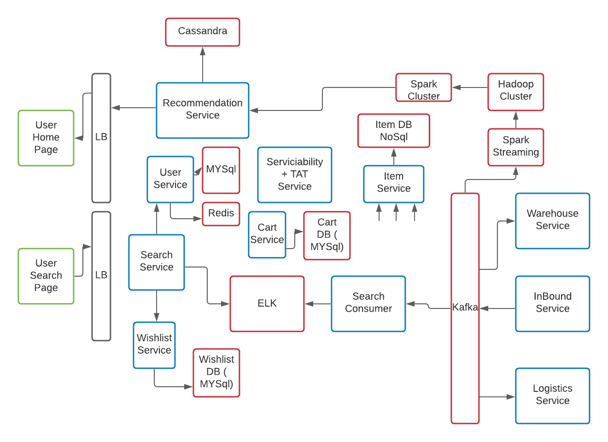

# Amazon High Level Design

I am listing down the functional and non functional requirements which I think is important. Feel free to extend this model as per your understanding and don't forget to give feedback to me - **78salmankashif6@gmail.com**

### Functional Requrements

- Customer can search for items
- Display home screen for customer
- Add item to Cart or Wish List
- CheckOut
- View Placed orders

### Non Functional Requirements

- Low Latency
- High Availability
- Consistency

## High level diagram containing User home page and Search flow.

#### Convention

- All components in green are user interface
- Black color is Load Balancer ( authentication, authorization etc as well )
- Blue components are core components
- Component in Red are mostly related to data like databases, cache, messaging queue, big data etc

#### Explanation of the components

**Inbound Service** - This service is responsible for bringing new item into the system. Whenever seller is adding new item this service comes into picture.
**Item Service** - Item service listens to Kafka topics. It is source of truth of all the items in the system. If you see closely items are very **non structured**. Lets take an example - For shirt the attributes can be color, size, brand however for Television attributes will be screen size, type of speaker ( dolby or not), type of screen ( LED, LCD etc ). So it will be much better if we take **NoSQL** database to store item details.
**Search Consumer** - Whenever new items come in Kafka this search consumer is responsible for making sure that this item is now available for user to query on. It feeds Elastic search Engine which is backed by database so that there will not be any data loss. Elastic search is very good at search based on applied filters and it also provides capabiloity of **Fuzzy Search**. Fuzzy search is nothing but if user did some typo it still matches search upto some distance and return result. It internally uses **Edit distance algorithm** to allow Fuzzy searching.
**Search Service** - There is a definite contract between search consumer and Search Service. This contract can be documented using **Swagger Documentation**. If you have not heard about Swagger I insist you to do a high level research on **Swagger API documentation**.
When user wants to search something 2 main things plays into the picture

1. Trying to figure out right set of items to display ( Recommendation service also plays a role here ).
2. We should not display items that system can not deliver to the customer. It will be a bad user experience if user sees an item and not able to order it.
   For this Search Service talks to **Serviciability + TAT Service**. This basically doe a lot of thing. First of all it tries to figure out that where exactly the product is reciding ( warehouse location ). Now given one of those warehouse or some of those warehouses. It tries to see do we have a way to deliver product from warehouse to the customer's pincode ? **Serviciability + TAT Service**.also takes care of how much time will it it take to deliver the item.
   If **Serviciability + TAT Service**. tells item can not be delivered, Search Service will filter out those items from the result set and return rest of remaining items.

**Search Service** night talk to **User Service** ( for User Data ) and it can query User Service to fetch some attributes of the User. Each time a Search happens an event is posted into **Kafka**. Reason is whenever someone is searching for an item, it says that person has the intent to buy that product in near future. That can be one of the very big source for building recommendation for the User.
From Search User can put to **Cart/WishList**. Person is putting item in wish list giving signal for recommendation.
**Kafka** will feed **Spark Stream**. It will be feed to **Hadoop Cluster** on top of that runs varios **DL/ML algorithms**.
Given a User and certail kind of products that they like, system can build 2 types of recommendations

1. What other products this User might like
2. How similar is this User to other users and based on products that other users have already purchased system would recommend a particular set of products to the User.

Once recommendation is processed this is placed into **cassendra Database** and it feeds **Recommendation Service** and recommendation service creates **Home page** for Customer.
Given **User ID**

1. General Recommendation
2. Each Category Recommendation

**USer Service** - It is backed up with MYSQL database and for fast query Redis cache is also there. For getting details about the user it will first query the **Redis cache** to get the details of the user. If user details are present it will be returned from Redis otherwise it will query database to get user's details from databse, place details into the **cache** and return the details to the service needing user details.
**Serviciability + TAT Service** - It will create a graph kind of structure at the **compile time** to fast the query response from **Search Service**. What is shortest path from location A to location B ( time taken as well ).
If there are N pincodes and M warehouses, it will pre compute for **N\*M** possible combination.
