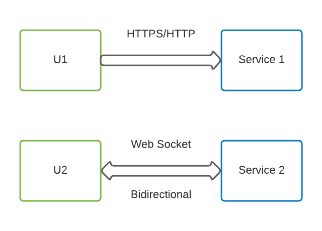

# Video Conferencing App High Level Design

I am listing down the functional and non functional requirements which I think is important. Feel free to extend this model as per your understanding and don't forget to give feedback to me - **78salmankashif6@gmail.com**

### Functional Requrements

- User can do 1 to 1 call
- User can start group call / meeting
- User can share Audio/Video/Screen Share
- User can start the recording
- View Placed orders
  > Note - **Video sharing or Screen Sharing** are fundamentally same. Stream of video content having different source. **Video** - Camera; **Screen Sharing** - Laptop screen

### Non Functional Requirements

- Super fast
- High Availability
- Data loss is ok

#### Convention

- All components in green are user interface
- Black color is Load Balancer ( authentication, authorization etc as well )
- Blue components are core components
- Component in Red are mostly related to data like databases, cache, messaging queue, big data etc ( in actual HLD )

### HTTP/HTTPs and Web Socket based

**TCP** - http/https are TCP based. client first establishes connection with the server ( **TLS Handshake** ). TCP is a **lossless protocol** It retries to send lost data if client did not receive **acknowledgement** ( I encourage you to learn how TCP works if you do not know the internals. ). This retry of TCP slows down the communication. As in the non functional requirement we mentioned that it is okay to have some data loss until and unless it is realtime.
Why TCP makes it slow

1. TLS handshake ( overburden for the communication )
2. TLS retry mechanism makes communication slow ( If it does not receive acknowledgement )
3. Header size of TLS is also bigger than UDP ( around 20 Bytes ) and it makes a bigger chunk.
4. TLS congestion control mechanism -> When client sees a congestion in the network it slows down the rate of sending data.

We can leverage **UDP** protocal for video calls because we are okay with data loss. Why **UDP** is fast

1. Client keeps on sending packets irrespective of the fact whether packet is reaching server ( This is okay because we don't want data consistency, we want video to be real time )
2. Header size of UDP is 8 Byte ( < 20 Bytes )
3. No congestion mechanism
4. No handshake

> Note We will use **TCP** for all other communication b/w client and server which does not include **video transfer**.

#### Explanation on how video call starts

For sending request for video call **Web Socket handler** is being used ( please bear with me I will explain the details in the coming section ). After receiver receives video call communication moves to **UDP** approach.
**Connector** - Connectoer helps user's machine to find to their public IP address. As drawn in the above diagram. **U1** sends request to router to get its public IP address, router / NAT uses it's public IP address to send this request to **Connector** ( If you do not know details of how NAT works please do google and read. It's pretty interesting no joke on this part ). Connector knows this request is coming from router with IP address **A.B.C.D** and from **port P1** it will tell NAT that this request is coming from P1. So this way U1 will know it's publicly identified **IP address** is **A.B.C.D:P1**. Similarly U2 will also identify its public IP address. Once the public IP address is identified they will share with each other using **Web Socket** based approach.

##### Group calling

All groups <= 5 users ( Small group )
All groups > 5 users ( Large group )

**Small Group** Each user has to send message to each of the member in the call separately. Bandwidth will be shared.
For N users in the group call, each user's bandwidth utilization will increase by ( N-1 ) times.

**Large Group**

User will only send video stream packets to **Call Server** then call Server will be responsible for sending to all other users in that call. Call Server's bandwidth utilization will increase and User's bandwidth will only be utilised once inplace of in previous case it had to send packats to each user ( N-1 times). So with slow bandwidth as well user will be able to communicate seamlessly. We can increase bandwidth of Call Server that is in our control.
We have to route it through call server if we want to record on going call. In Peer to Peer communication there is no way we can record the call. ( Practical example - I use Microsoft teams on day to day basis. If you have used it then you might have observed that when you call your colleague then you do not see **Start Recording** option ( Peer to Peer ) and if you join meeting then you see **Start Recording** option ( Through call Server ). Intersting right!! ).
