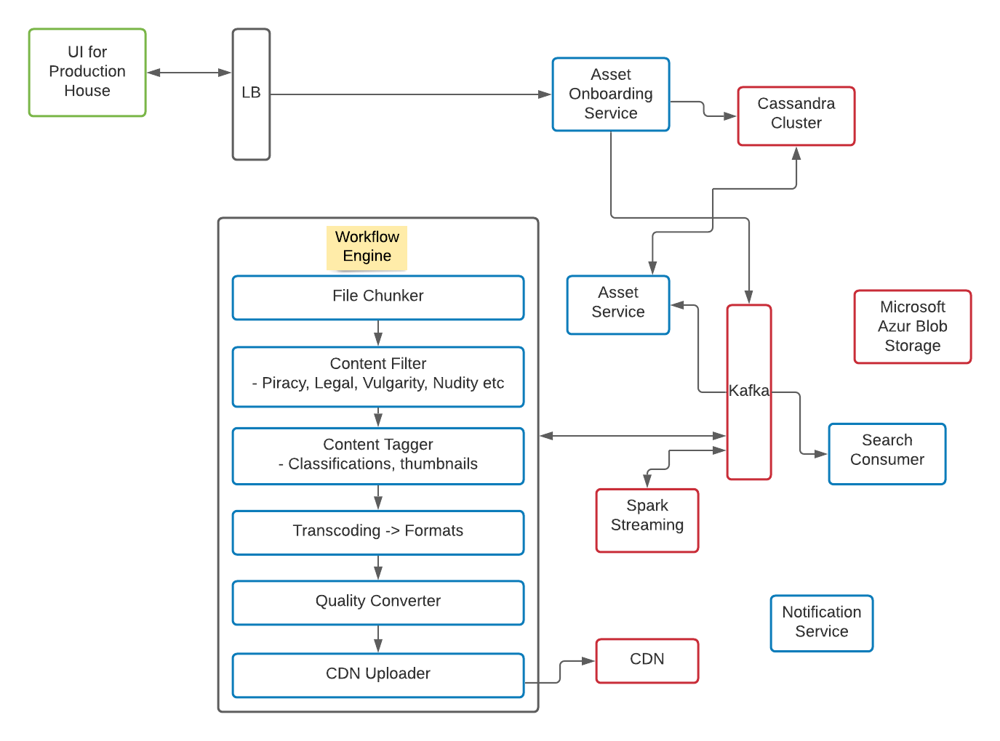
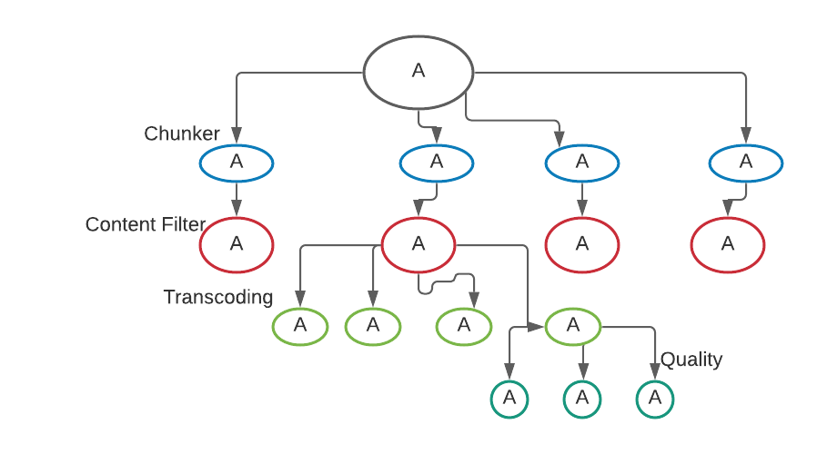
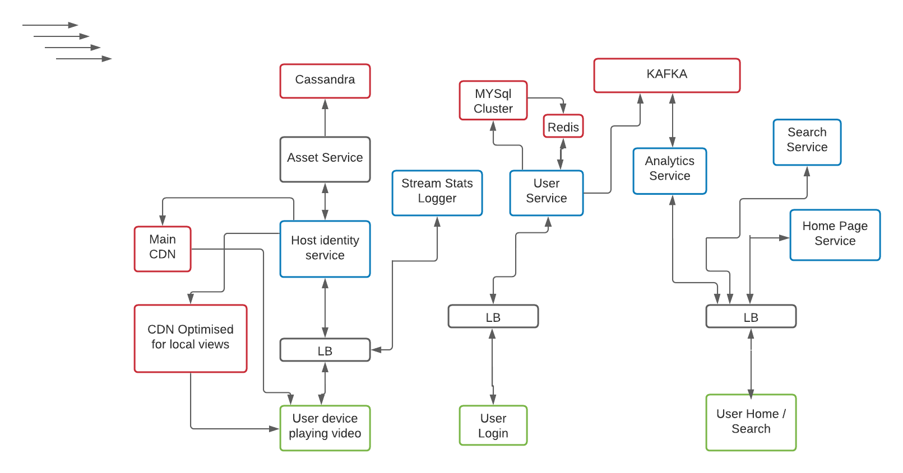
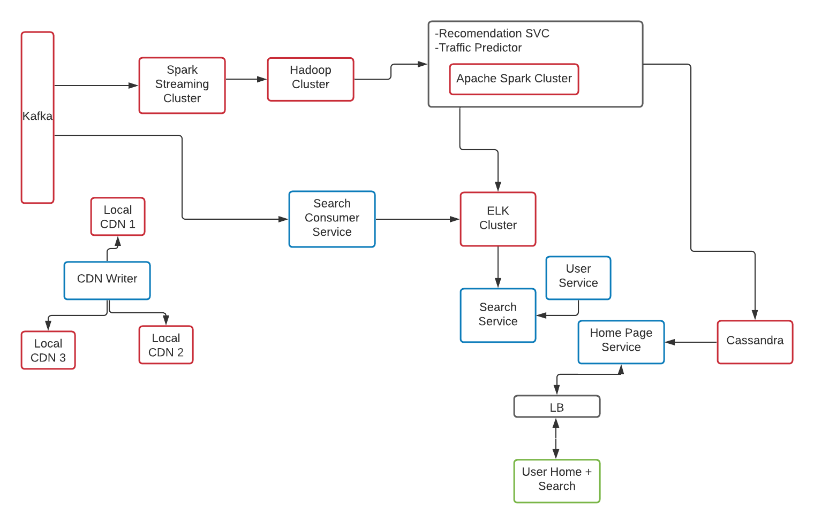

# Video Streaming Application High Level Design

I am listing down the functional and non functional requirements which I think is important. Feel free to extend this model as per your understanding and don't forget to give feedback to me - **78salmankashif6@gmail.com**

### Functional Requrements

- Production house can upload video
- User's Homepage + Search
- User can Play Videos ( different quality, extension, dimention )
- Support all types of devices

### Non Functional Requirements

- No buffering ( Low Latency, High Availability )
- Good Recommendation
- User's Session time ( Low Latency, High Availability )

> Note: Suppose there are N supported formats, M types of different dimention screen videos, ) types of bandwidth ( video quality ). Then in total N*M*O videos will be needed.

#### Convention

- All components in green are user interface
- Black color is Load Balancer ( authentication, authorization etc as well )
- Blue components are core components
- Component in Red are mostly related to data like databases, cache, messaging queue, big data etc ( in actual HLD )

### Video Upload HLD from Production house

> Note: Client requests chunks of videos while user is watching it requests for other set of chunks. If client realises subsequesnt chunks are not coming well in time, it starts requesting for low quality chunks ( **Adaptive bitrate streaming** )

#### Description of components of video upload flow

1. First of all production house will upload video in their machine ( VM or anything ), then in someway they will share the machine details to the platform. Then platform using **SFTP** dumps movie to its own **BLOB storage**. Admin of video also provies **metadata** information ( uploader details, description, lot of images, large variety of tags etc ). These metata information is being stored in **Cassandra**.
2. After successful upload happens in the blob storage, Asset **onboarding service**
   posts an event into **Kafka** about completion of storage.
3. One of the consumer of above kafka topic is **Content Processor** ( **Workflow engine** ).
4. In the **Workflow engine** first of all **File Chunker** will chunk the file at the very beginning. It will break entire video into small size stream chunks ( Refer the diagram for the flow ).
5. For each chunk **Content filter** is called. It filters the chunks based on the criteria ( Violence, Vulgarity, Nudity, Piracy etc ). All filtering can be done parallely ( using many instance of Content filter. Different intance may parallely work on differnt different chunks ). After the processing is done it posts the event into Kafka.
6. **Content Tagger** listens to above Kafka topic and does the tagging parallely on different different chunks. It creates relevant tags and **thumbnails**. ( We will discuss it in detail in near future ). After compeletion of the process it posts event as Kafka topic.
7. **Transcoding** listens to above published topic. It converts chunks into different differnt format. Ex - AVI, MP4 etc. After compeletion of the process it posts event as Kafka topic.
8. **Quality Converter** listens to above published topic. It converts chunk into different different quality stream. Ex - 144 p, 244 p, 480 p, 720 p etc. After compeletion of the process it posts event as Kafka topic.
9. After the above processing, workflow engine starts to accumulate chunks of same video and it starts to upload it into **Content delivery network** ( CDN ). Then after successful completion of video upload into CDN, it posts event into Kafka. **Notification service** uses this event to send notification to production house about successful upload of their video. **Serarch consumer** will also listens to this completion event and makes this video searchable by the Users.

### User facing product

#### Description of components of User side

**User Service** - Source of truth of all user related information. Lot of times many other services are calling user service into **Eco System** for the details of a particular user. Every time calling **MYSQL** will slow down the performance. So to reduce latency we can use some caching ( Reids, LRU cache ). Cache will hold all the details of user ( payload ) with key as **user_id**. **Serach Service** can call user service to get age of user to filter content based on age.

If analytics says people are mostly going on next page and not viewing video of 1st page ( depicts bad recommendation ). It gives area of improvement ( Both for home service as well as Search Service ).

> Note: All information about CDN's, videos lie in **Cassandra**.
> **Host Identity Service** - It knows which video you want to play and they know from where you are coming.
> Host service queries **Asset Service** to get all **CDN's** that are available with this video which user wants to view and given the location of the user and the location of all the videos that are there try to come up with one of the CDN that is responsible to play this particular video. They will assign CND which is clouse to geographical location of user.

From analytics if eco system comes to know people of India is watching **Money Heist** very much. We could actually host a CDN in India and upload that video to that CDN to reduce the latency.

**Stream Stats Logger Service** - If video is closed after 10-20 seconds then it is probably not a good video. But if lot of people are watching more than 90% of video content it can be classified as good video

### Home Page and Search HLD

